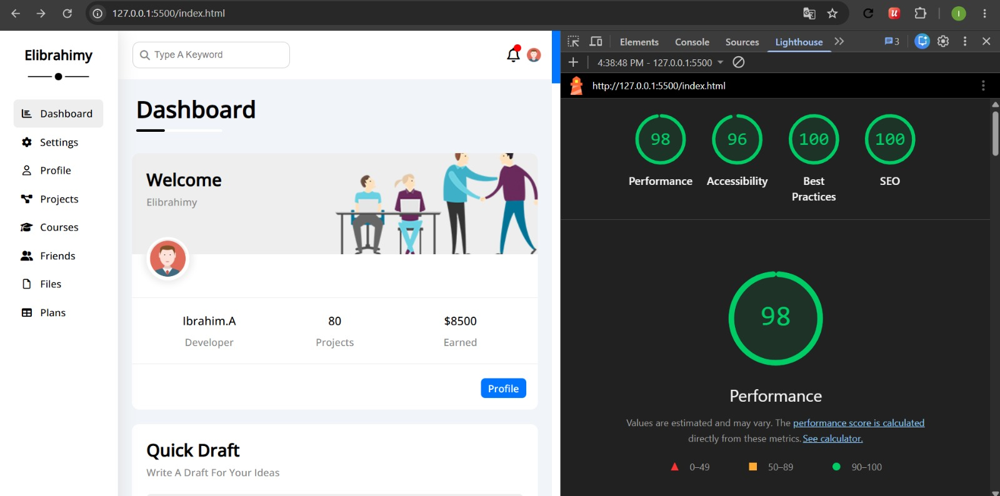
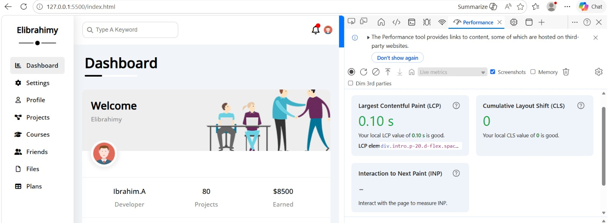

# Simple Account Profile

A responsive project illustrates how an account for some platforms could be.

**Check it out :** [Simple Account Profile](https://simple-account-profile.vercel.app/)

## What was changed to enhance this project

* Set (dir) attribute in \<head> tag for all pages. 
* Organized assets folder and renamed some files.
* Switched to use symantic HTML elements
* Set \<title> for all pages that appears on browser tab to match "Website name | Page title"
* Added Canonical URL to every page
* For SEO : Get all pages indexed.
* Set meta tags for website appearance as social cards.
* Reviewed on all \ tags and their "alt" attribute.
* Make website respect "prefers-reduced-motion"
* Switched to use make following a typographic scale (rem not px).
* Added (loading="lazy") attribute to all images.
* Added 404 not-found page.

## Final results

* Light House result

* Performance result
